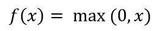
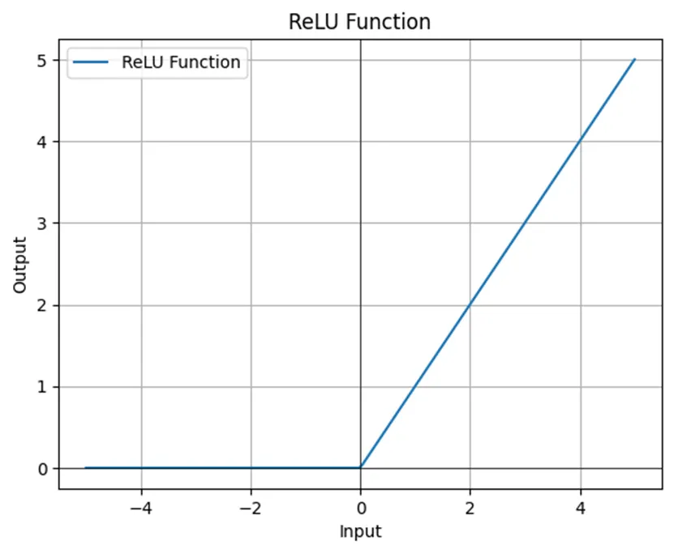
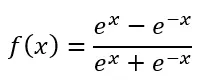
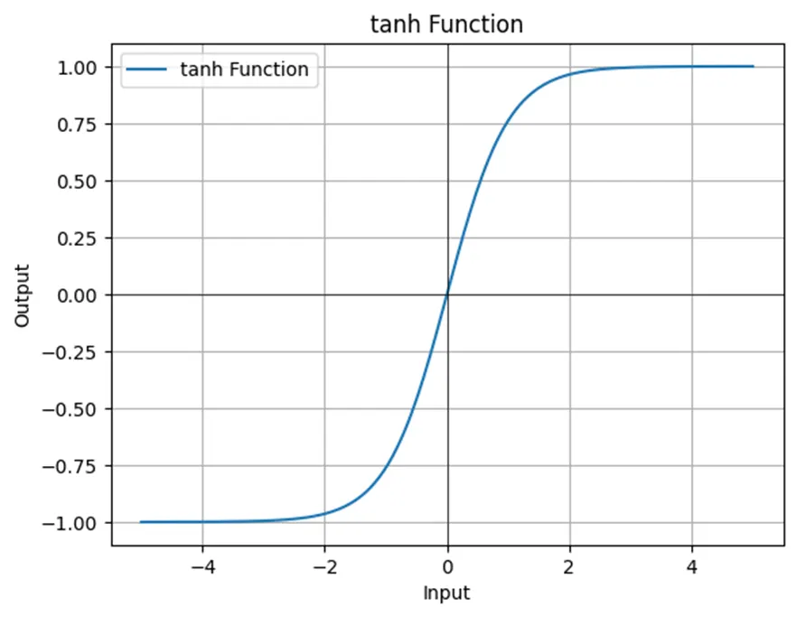

Name: Introduction to Deep Learning 

Q&A:

1. What is a Neural Network?
- A computational model with layers of interconnected nodes (neurons) that process inputs through weighted connections and activation functions to learn patterns and make predictions.

2. Structured Data vs Unstructured Data?
- Structured data has fixed format (tables, databases with rows/columns). Unstructured data has no predefined format (images, text, audio, video) and requires more complex processing.

3. Activation functions
3.1. Sigmoid or logistic function

3.2. ReLU — Rectifier Linear Unit

3.2. Tanh (Hyperbolic Tangent)

4. RNNs (Recurrent Neural Networks) are good for data with a temporal component?
- RNNs maintain hidden states that carry information from previous time steps, making them suitable for sequential data like time series, NLP, and speech recognition.
