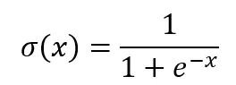
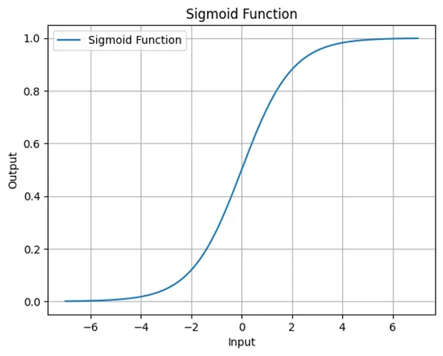
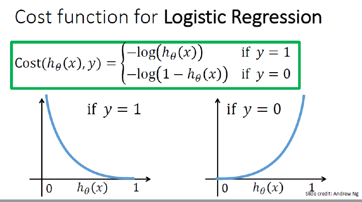
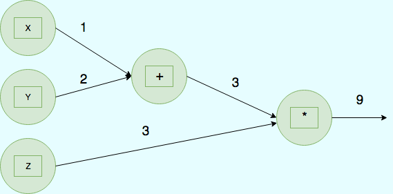

# Neural Networks Basics

## Q&A:

### 1. Binary Classification
- **Definition**: Classifying an image into one of two classes (e.g., cat or not cat)
- **Image Representation**: Images are saved in red, green, blue (RGB) color channels
- Each image is represented as a flattened vector of pixel values

### 2. Logistic Regression
- **Goal**: Given input x, estimate the probability P(y = 1 | x)
- **Output**: A value between 0 and 1 representing the probability
- Uses the **sigmoid function** to map any real number to a value between 0 and 1

### 3. Logistic Regression Cost Function
- **Purpose**: Measures how well the model is performing
- **Principle**: The larger the error, the more it gets magnified in the cost
- Used to optimize the model parameters during training

**Key Difference**: The **loss function** computes the error for a single training example; the **cost function** is the average of the loss functions of the entire training set.

### 4. Gradient Descent
- **Purpose**: Optimization algorithm used to minimize the cost function
- **How it works**: Iteratively updates parameters by moving in the direction of steepest descent
- **Learning rate**: Controls the step size in each iteration

### 5. Computation Graph
- **Purpose**: Visual representation of mathematical operations
- **Benefits**: Helps understand forward and backward propagation
- **Structure**: Nodes represent operations, edges represent data flow

### 6. Chain Rule
- **Purpose**: Method for computing derivatives of composite functions
- **Application**: Essential for backpropagation in neural networks
- **Principle**: The derivative of a composition is the product of derivatives

### 7. Vectorization
- **Definition**: Eliminating unnecessary for loops by using matrix operations
- **Benefits**: Significantly faster code execution
- **Implementation**: In Python, vectorization is done using NumPy
- **Example**: Instead of looping through each example, process all examples simultaneously using matrix multiplication

### 8. Broadcasting in Python
- **Definition**: NumPy's ability to perform operations on arrays of different shapes
- **How it works**: Automatically expands smaller arrays to match larger arrays for element-wise operations
- **Benefits**: Enables concise code without explicit loops or reshaping
- **Rules**: Broadcasting follows specific rules where dimensions are compared from right to left
